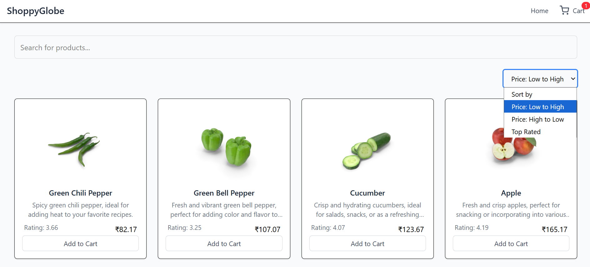
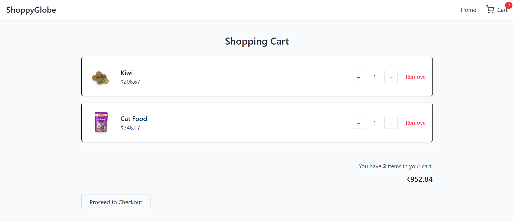
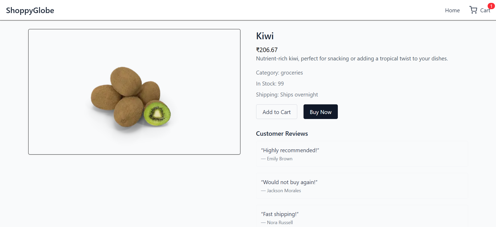
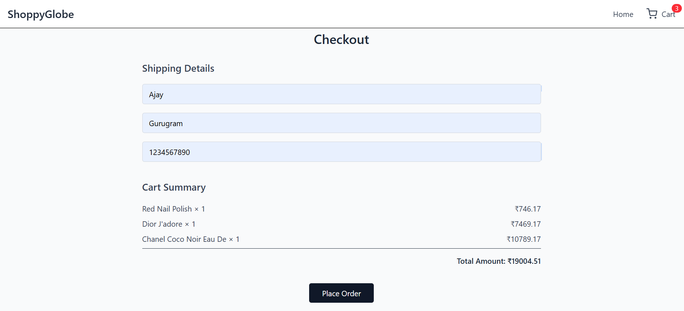
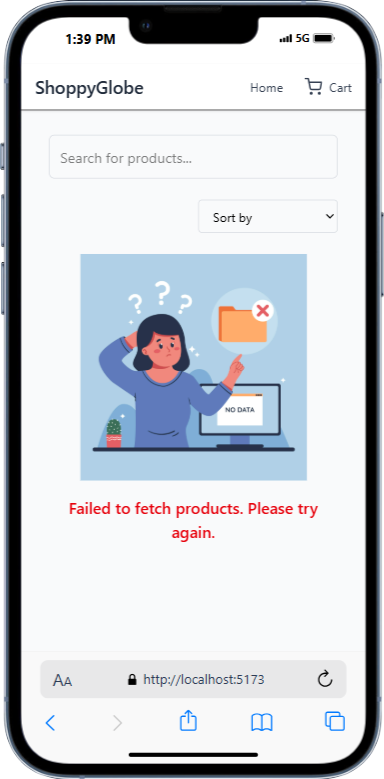
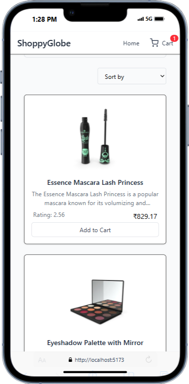
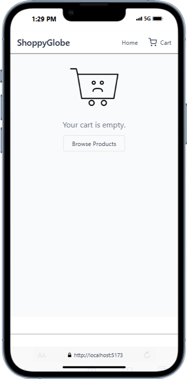

# 🛍️ ShoppyGlobe - E-commerce Application

ShoppyGlobe is a fully responsive e-commerce frontend project built using **React** and **Redux**. Users can browse products, add items to the cart, manage quantities, and place orders. The project simulates a real-world shopping experience using dummy JSON API data.

Live Demo - https://shoppy-globe-ten-iota.vercel.app/   

---

## 📸 Screenshots

### 🏠 Homepage  
Responsive product grid with search and filter functionality  


### 🛒 Cart  
Displays added products, updates quantities, and shows total price in ₹  


### 📦 Product Details Page  
Detailed view with description, rating, and purchase options  


### ✅ Checkout Page  
Form to collect shipping information and review order before placing it  


### 💬 Error Handling  
Handles fetch and page errors gracefully with visuals  


### 📱 Responsive Design  
Fully responsive for mobile screens  
- Homepage  
    
- Cart  
  

---

## 🚀 Features

- 🔎 **Search products** by title
- 🎚️ **Sort products** by price and rating
- 🛒 **Add to cart** and manage quantities
- ✅ **Checkout** with shipping info
- 🌐 **Responsive design** for mobile and desktop
- ⚠️ Graceful **error handling**
- 🌟 Minimal, clean **UI with Tailwind CSS**
- 🔥 Toast notifications on actions

---

## 🧰 Tech Stack

- **React** (functional components & hooks)
- **Redux** (cart state management)
- **Tailwind CSS** (utility-first styling)
- **React Router** (client-side routing)
- **react-hot-toast** (notifications)
- **DummyJSON API** (mock product data)

---

## 📦 Folder Structure
```bash
├── public/
│ └── favicon.ico
├── src/
│ ├── assets/ # Screenshots, icons, static assets
│ ├── components/ # Reusable components
│ ├── hooks/ # Custom hooks (e.g., useProductsData)
│ ├── pages/ # Page components (Cart, Checkout, etc.)
│ ├── store/ # Redux slices
│ └── App.jsx # Main app routing and layout
```

## 🛠️ Getting Started

### 1. Clone the repository
```bash
git clone https://github.com/your-username/shoppyglobe.git
cd shoppyglobe-project
```

### 2. Install the dependencies
```bash
npm install
```
### 3. Run the development server
```bash
npm start
```

The app will run at http://localhost:5173

